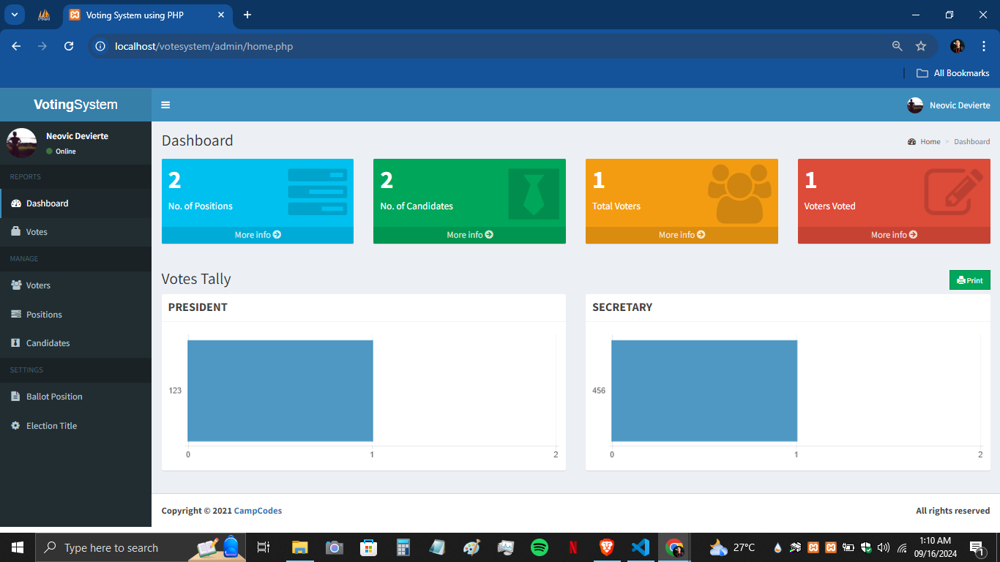
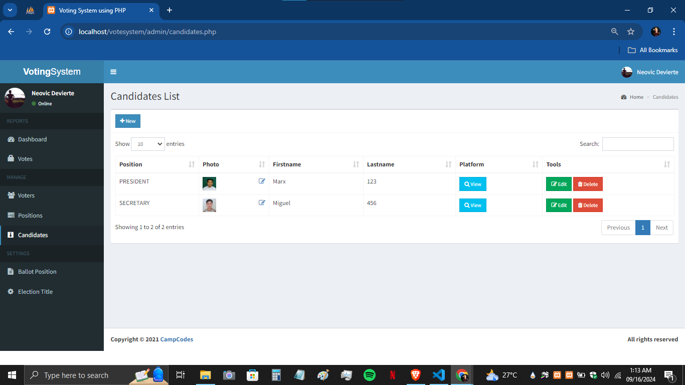
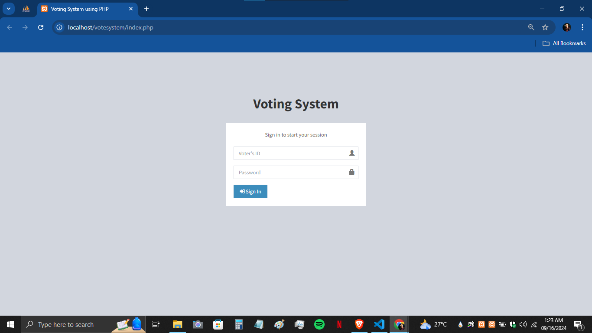

# SD-3101 [Online Voting System]


## Table of Contents

- [Introduction](#introduction)
- [Project Overview](#project-overview)
- [Objectives](#objectives)
- [Features](#features)
- [Technologies Used](#technologies-used)
- [Setup and Installation](#setup-and-installation)
- [Usage Instructions](#usage-instructions)
- [Project Structure](#project-structure)
- [Contributors](#contributors)
- [Project Timeline](#project-timeline)
- [Chagelog](#changelog)
- [Acknowledgments](#acknowledgments)
- [License](#license)

---

## Introduction

A PHP-based online voting system is a software tool that allows users to vote via the internet. It offers a convenient and efficient way for users to participate in voting from any location, at any time. These systems are commonly used for various purposes, including political elections, school and university elections, corporate decision-making, and surveys.

## Project Overview

This online voting system is designed to provide a more efficient and convenient way of voting using PHP and MySQL. It was developed to address the challenges of traditional voting methods, such as long queues, location accessibility, and the time-consuming manual tallying of votes.

- The primary target users of this system are educational institutions (for student council elections), corporate organizations (for internal decision-making), and small-scale community events. Additionally, administrators will benefit from streamlined voter management and real-time monitoring of election results.

- The system's real-world applications include simplifying the voting process, allowing voters to participate from anywhere and at any time. By reducing the likelihood of errors, minimizing the risk of fraud, and enhancing transparency, this online voting system can significantly improve the overall integrity and accuracy of elections. Furthermore, it reduces the cost and time involved in organizing traditional voting events.

## Objectives

State the main objectives of the capstone project, such as:

- Develop a solution to provide an efficient and convenient way of voting, allowing users to participate from anywhere and at any time.

- Implement features to improve the accuracy and integrity of the voting process by reducing errors, minimizing fraud, and increasing transparency.

- Test and validate the system's ability to reduce the cost and time associated with traditional voting methods.

## Features

List the main features of the project:

Admin-side:

- Dashbord: provides an overview of the voting system. It displays the total number of positions, candidates, voters, and voters who have cast their votes, with clickable links to access detailed pages.

- Update Admin Profile : Allows the admin to update their username, first name, last name, photo, and set a new password. To save changes, the admin must enter their current password for security.

- Result Tally via Horizontal Barchart: Visual representation of each position of voting results.

- Offer reports on each position, candidate, and a list of voters who participated in the election.

- CRUD (Create, Read, Update and Delete) Operations for Voters, Candidates, and Positions: Easy management of voter, candidate, and position data.

- Ballot Positioning: It allows you to adjust or rearrange the order of positions on the ballot.

- Configure Election Title: allows you to edit and set the title of the current election, providing a clear identifier for the voting event.

Voter's Side:

- Voter's Dashboard: Where voters can view a slideshow of candidate information before logging in to vote, including the candidate's platform, photo, name, and position. Voters can also preview their ballot before and after submitting their vote.

## Technologies Used

Mention the tools, frameworks, and technologies used in the project:

- Programming Languages: JavaScript, PHP
- Frameworks/Libraries: jQuery, Bootstrap
- Databases: MySQL
- Software used: WAMP/ XAMPP/ LAMP/MAMP
- Browser used: Google Chrome, Microsoft Edge, Mozilla Firefox, Brave
- Other Tools: HTML, AJAX

## Setup and Installation

Step-by-step instructions for setting up the project locally.
   create folder at your local disk name "votesystem"

1. **Clone the repository using Git:**

   ```bash
   cd /path/to/your/local/disk
   ```

   Clone the Repository into the votesystem Folder: Use the git clone command with the --branch option to specify the branch and --single-branch to limit it to the specified branch:

   ```bash
      git clone --branch master --single-branch https://github.com/varmahes2/votesystem.git votesystem
   ```

   This command will clone the master branch of the repository into a folder named votesystem on your local disk.

2. **Set up the environment:**

- Download and Install XAMPP
- Open the XAMPP and click Start Apache and MySQL services
- Click MySQL admin it will direct you to <http://localhost/phpmyadmin/>

3. **Folder Directory:**

- At your Local Disk.
- Move "votesystem" folder inside the xampp.
- after xampp move it inside the htdocs folder.

4. **Database Setup:**

- at <http://localhost/phpmyadmin/> click new
- Database name = votesystem and click create
- Click import
- Choose file = At votesystem folder find db folder and select votesystem.sql file and open

5. **Run the projcet:**

- Access the admin side by pasting or typing this at your browser
  - <http://localhost/votesystem/admin/index.php>
- Access the voter side by pasting or typing this at your browser
  - <http://localhost/votesystem/index.php>

## Usage Instructions

Provide detailed instructions on how to use the project after setup:

1. **Admin Login:**

- Username:
  - nurhodelta
- Password:
  - password
- Admin side screen short:



- Another Screenshot



2. **Voter Side:**

- To create voter's account go to admin
- Under Manage
  - Voters page
    - Click new Enter First and Lastname, Password, Photo (optional)    and save.
      - Copy the auto generated 15 strings (ID)  
        - Open the Voter's side enter ID and Password



## Project Structure

Explain the structure of the project directory. Example:

```bash
.
├── admin/
├── bower-components/
├── db/
├── dist/
├── images/
├── includes/
├── plugins/
├── tcpdf/
├── home.php
├── index.php
├── login.php
├── logout.php
├── preview.php
├── README BACKUP ORIG.txt
├── README.md
└── submit_ballot.php
```

## Contributors

List all the team members involved in the project. Include their roles and responsibilities:

- **Marx Miguel Escaño**: Lead Developer,
 Backend Developer
- **Aldie Mae Almodal**: Frontend Developer, UI/UX Designer
- **Gerald Villaran**: Project Manager, Tester

## Project Timeline

Outline the project timeline, including milestones or deliverables. Example:

- **Week 1-2**: Research and project planning.
- **Week 3-5**: Design and setup.
    - https://www.youtube.com/watch?v=FNmUtghXdp0
    - Added Features
       - Forgot Password for Admin
       - Pre-Vote Information Slide
       - Voting Progress Bar

   - Feature to Implement: Dockerize Project
   - Completion Date: 27/10/2024
   
- **Week 6-10**: Implementation.
- **Week 11-12**: Testing and debugging.
- **Week 13-14**: Final presentation and documentation.

## Changelog

### [Version 1.0.0] - 2024-09-07

- Initial release of the project.
- Added basic functionality for [Feature 1], [Feature 2], and [Feature 3].

### [Version 1.1.0] - 2024-09-14

- Improved user interface for [Feature 1].
- Fixed bugs related to [Feature 2].
- Updated project documentation with setup instructions.

### [Version 1.2.0] - 2024-09-21

- Added new functionality for [Feature 4].
- Refactored codebase for better performance.
- Added unit tests for [Feature 3] and [Feature 4].

## Acknowledgments

Acknowledge any resources, mentors, or external tools that helped in completing the project.

The Collaboration and Version Control using Github tutorial and <https://tree.nathanfriend.io/>..

This project was built from [Original Project Name](https://github.com/varmahes2/votesystem/tree/master), created by varmahes2. You can view the original repository [here](https://github.com/varmahes2/votesystem/tree/master).

## License
This project is licensed under the [GNU General Public License v3.0](LICENSE).

